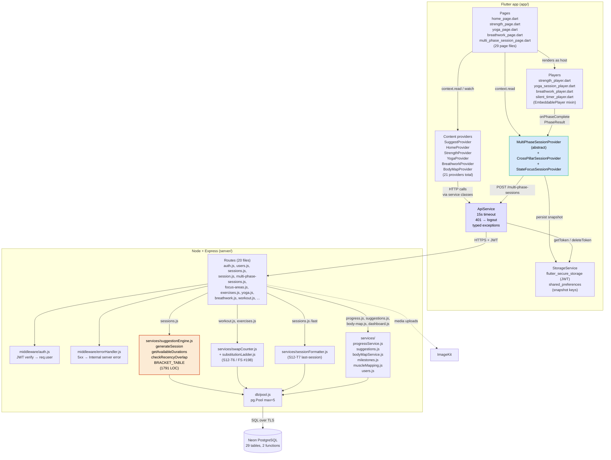

# DailyForge — Architecture Diagrams

> Mermaid source. Renders inline on GitHub. PNG export of Diagram 2 is at `architecture-diagram.png`. Last regenerated 2026-05-15 (Sprint 14 closed).

---

## 1. System Context

```mermaid
graph TB
    User["User on Android phone"] -->|Flutter app| App["DailyForge Flutter App<br/>app/"]
    App -->|HTTPS REST<br/>JWT Bearer| API["DailyForge Backend<br/>Node + Express<br/>server/src/index.js"]
    API -->|SQL over TLS| DB[("Neon PostgreSQL<br/>ap-southeast-1<br/>(Singapore)")]
    API -->|REST| ImageKit["ImageKit CDN<br/>(media)"]
    App -->|GLB asset<br/>(bundled)| GLB["assets/models/<br/>male_anatomy_split.glb"]
    App -->|cached_network_image| ImageKit
```

**Narration.** One external actor (the founder on a physical Android phone today; future users post-launch), one mobile client, one backend, one database, one media CDN. There is no separate dev environment — the Flutter client points at the prod Neon instance via the founder's LAN IP (`app/lib/config/api_config.dart:13`). The 3D body-map asset is bundled into the app rather than fetched from ImageKit.

---

## 2. Component Diagram



**Narration.** This is the load-bearing diagram for an outside reviewer. The Flutter app is built around 21 `ChangeNotifier` providers wired in `main.dart`; pages read providers and dispatch user actions; providers call into thin service classes that all route through `ApiService` (the single HTTP boundary with timeout, 401-handling, and typed exceptions). The `MultiPhaseSessionProvider` abstract base + 2 concrete subclasses (cross-pillar and state-focus, S14-T5) are isolated from the content providers because they own a different concern — the orchestrator state machine and the embedded-player handoff via `PhaseResult`. On the backend, the suggestion engine is the central service touched by `routes/sessions.js`; the swap-counter machinery (S12-T6) lives in `services/swapCounter.js` and is invoked from `workout.js` (slot/choose) and `exercises.js` (exclude / keep-suggesting). All DB access goes through `db/pool.js` — a single `pg.Pool` capped at 5 concurrent connections to fit Neon free-tier limits.

---

## 3. Sequence — "Start a session"

```mermaid
sequenceDiagram
    autonumber
    actor U as User
    participant HP as HomePage
    participant SP as SuggestProvider
    participant SS as SuggestService
    participant API as ApiService
    participant R as routes/sessions.js
    participant E as suggestionEngine.js
    participant DB as Postgres
    participant Launcher as session_launcher.dart
    participant CP as CrossPillarSessionProvider
    participant MPS as MultiPhaseSessionPage
    participant Player as StrengthPlayer (embedded)

    U->>HP: Tap focus chip, pick duration in sheet
    HP->>SP: selectBodyFocus('biceps', timeBudgetMin: 30)
    SP->>SS: requestBodyFocusSession(...)
    SS->>API: post('/sessions/suggest', {focus_slug, entry_point: 'home', time_budget_min})
    API->>R: POST /api/sessions/suggest + Bearer JWT
    R->>R: validate shape, resolve focus, enforce body/state contract
    R->>E: generateSession({user_id, focus_slug, entry_point, time_budget_min})
    E->>DB: SELECT focus_areas WHERE slug=$1 AND is_active=true
    E->>DB: SELECT user_pillar_levels WHERE user_id=$1
    E->>DB: SELECT focus_muscle_keywords, user_excluded_exercises, ...
    E->>DB: checkRecencyOverlap → SELECT sessions JOIN focus_overlaps
    E-->>R: {session_shape: 'cross_pillar', phases: [...], warnings: [...], metadata}
    R-->>API: 200 + body (metadata.source='engine_v1')
    API-->>SS: Map<String, dynamic>
    SS-->>SP: SuggestedSession
    SP->>SP: persist focus_slug + time_budget_min to SharedPreferences
    SP-->>HP: notifyListeners (currentSession set)

    U->>HP: Tap Start on today's-session card
    HP->>Launcher: dispatch(session)
    Launcher->>CP: startFresh(session, storage: storageService)
    CP->>CP: init state machine, persist snapshot
    Launcher->>MPS: context.go('/session/cross-pillar')
    MPS->>Player: StrengthPlayer(isEmbedded: true, phaseMetadata, onPhaseComplete)
    Player->>Player: run session, log sets via PUT /api/session/:id/log-set
    Player->>CP: onPhaseComplete(PhaseResult)
    CP->>CP: advance, persist
    Note over MPS,Player: Loop until allPhasesDone == true

    MPS->>CP: complete(storage, api)
    CP->>API: post('/multi-phase-sessions', {focus_slug, session_shape, ids, end_intent: 'completed'})
    API->>R: POST /api/multi-phase-sessions
    R->>DB: BEGIN; INSERT multi_phase_sessions RETURNING id;<br/>UPDATE sessions/breathwork_sessions SET multi_phase_session_id=...; COMMIT
    R-->>API: 201 {id}
    CP->>CP: clear snapshot
    MPS->>MPS: navigate to /session/summary
```

**Narration.** This sequence covers the full round-trip from focus-chip tap to multi-phase row write. Key entry points: `home_page.dart` (`_onChipTap`, around line 79) → `SuggestProvider.selectBodyFocus` (`app/lib/providers/suggest_provider.dart:93`) → `SuggestService.requestBodyFocusSession` → `ApiService._send` (`app/lib/services/api_service.dart:125`) → `POST /api/sessions/suggest` handler at `server/src/routes/sessions.js:91` → `generateSession` at `server/src/services/suggestionEngine.js:1714`. The session-complete fanout is `MultiPhaseSessionProvider.complete` (`app/lib/providers/multi_phase_session_provider.dart:285`) → `_writeMultiPhaseSessionRow` (line 301) → `POST /api/multi-phase-sessions` handler at `server/src/routes/multi-phase-sessions.js:54`. State-focus sessions follow the same shape but route to `/session/state-focus` and use `StateFocusSessionProvider` (no 3s auto-advance countdown).
